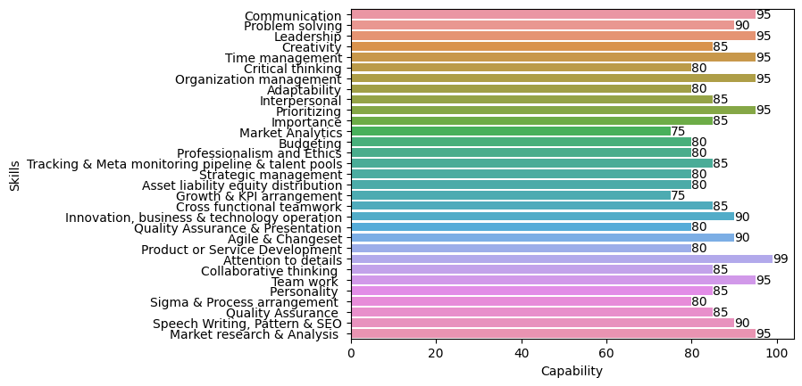

:toc: right
:toc-title: Resume Contents
:doctype: article
:icons: font

= RASHADUL ISLAM
B.Sc (double undergraduate) CSE, CSC

== Specialization and Expertise

[CAUTION]
.Specialization
====
System Software, Software Engineering, Canada-Bangladesh
====
[IMPORTANT]
.Expertise
====
Software Engineering, DevOP Full Stack, Consultant IT-Infrastructure-ICT, Entrepreneur, Business development mentor, Big Data Analyst, Artificial Intelligence & Nanotechnology, Algorithm Design, Product or Service Ecosystem Designer, Organization Branding & Policy Designer, Open Source Ambassador, Keynote Speaker, Translator, Student & Career Counselor
====
<<<
== Latest picture:
image::https://raw.githubusercontent.com/impactLens/cvOfRashadul/refs/heads/main/RashadulIslam.jpg[Rashadul Islam,width=30%,height=30%]

//image::RashadulIslam.jpg[Rashadul Islam,width=30%,height=30%]

== Personal Details

.Personal Details
|===
|Entity |Details

| Name:             | RASHADUL ISLAM
| Name of Mother:   | MAHFUJA KHATUN
| Name of Father:   | Md. SERAJUL ISLAM
| Date of Birth:    | JANUARY 01, 1984
| Nationality:      | Bangladeshi by Birth
|===

=== Skills of Rashadul Islam

image::https://raw.githubusercontent.com/impactLens/cvOfRashadul/refs/heads/main/skillsRoss.png[Revised skillset,width=60%;height=60%]

image::https://raw.githubusercontent.com/impactLens/cvOfRashadul/refs/heads/main/itCantBeTaught.png[Strong Subjective Understanding,width=55%,height=55%]

////
                                                                                  //image::itCantBeTaught.png[Strong Subjective Understanding,width=55%,height=55%]

////

=== Language proficiency

.Language Adaptability
|===
|Language           |Overall Band Score | Out of Score

|ENGLISH            | 8.5               | 10
|FRENCH             | 6.5               | 10
|BANGLA             | 9.0               | 10
|SPANISH            | 5.5               | 10
|===

=== Programming languages & tools
.Programming, Technical & Technological Skills
|===
| i |i |iii

|J2SE           |J2EE           | Mariadb
|MySQL          |MySQL workbench|Net beans
|JavaScript     |HTML5          |XML
|CSS            |Apace Tomcat   |JBOSS
|Oracle 21      |Git            |SVN
|C++            |C              |Lisp
|Emacs          |Vim            |Xcode
|Atom           |Ansible        |Docker
|SaaS           |PaaS           |IaaS
|IoT            |Python         |Matlab
|SPSS           |R              |AutoCAD
|Blender        |Audacity       |AsciiDoc
|Amazon EC2     |Lamp server    |XAMPP
|Red hat        |Microsoft Windows server |Open Suse
|IoS            |MacOS          |Android
|Raspberry pi   |Power BI       |IBM Watson
|Open shift     |Kubernetic     |Bugzilla
|Google workplace|Microsoft 365 |Google Analytics
|YouTube studio |CCNA toolkit   |Plant UML
|Smart Digital City & Citizen Management |Dynamic programming |Agile or prince2 or scrum project management
|===

=== Interest

.Interest
|===
|i              | ii                | iii                           | iv

|Tennis         | Sailing           | Kayaking                      | Swimming
|Hiking         | Rugby             | Chess                         | Go
|Maze design    | Crossword         | Beekeeping                    | Poker
|Birds flocking | Fish schooling    | Animal herding and ant colony | Swimming
|Golf           | Sudoku            | Magic Square                  | Billiards
|===

<<<

== Work experience
.Work Experience and Awards, Achievements
|===
|DESIGNATION | ORGANIZATION | GEO LOCATION  | YEAR

|Full-stack DevOP (Java Enterprise Editions(ERP, SAP, Cloud Computing, WebApp, MobileApp, Microservice)  | Contractual | Bangladesh - Canada | June 2003 - Current
|Author (Technological Fiction) | Engineering Magazine, ECA, Concordia University | Canada | Fall 2003 - Current
|Consulting Analyst, Data Science and Big Data, Statistical-economical-financial Analysis | Contractual | Canada-Bangladesh | December 2011 - Current
|Creative Writer                                   | Ads Agency and Media Houses, Contractual | Bangladesh | Summer 2006 - Current
|Ambassador, Fedora project                 | Open source community project under Red hat | OS Community | Fall 2005 - Current
|Chief Global Operation Executive           | QUEST Consultancy | Bangladesh | Sep 2016 - Sep 2023
|Technical Review Writer                    | Contractual  |  Bangladesh | August 2011 - September 2020
|Organizer                                  | First convocation, Primeasia University | Bangladesh | Winter 2010
|Visiting Trainer [Funded by JICA]          | Bangladesh Computer Council | Bangladesh | Summer 2010
|Mentor, Business Developer                 | SME | Bangladesh | January 2009 - January 2023
|Organizer                                  | BASIS Soft Expo 2011 | Bangladesh | Winter 2011
|Career Counselor                           | ECA Concordia, IUB | CA & BD | Fall 2004 - Fall 2008
|===

<<<

== Projects

.Project performance
|===
|TITLE|ORGANIZATION|GEO LOCATION | EFFORT | ACHIEVEMENT

|Organization developer & Adjunct Faculty |A leading private university |Bangladesh |Estimated 32000 hours | CMMI level 3, PMMI level 2
|Digital Infrastructure Designer, Enterprise resource planning ( ERP ) | Primeasia University | Bangladesh | 30000 hours | CMMI level 3, PMMI level 4
|iSalesEngine & Analytic Developer (J2EE, J2SE, C++, Python, Oracle, Apache Tomcat, Responsive HTML5, CSS, LISP)  |Quest Consultancy | Bangladesh | Estimated 42240 hours | CMMI level 4, PMMI level 3
|Data Analyst (Customer purchase behavior, sales & supply chain)  |Contractual, a medicine company | UK | Estimated 50000 hours | CMMI level 4, PMMI level 4
|Technical lead & Technical Writer|LGED, BTCL, USAID|Bangladesh |Estimated 12063980 hours | CMMI level 5, PMMI level 5
|Associate Consultant IT and ICT |S.F. Ahmed & Co. |Dhaka, Bangladesh | Estimated 200000 hours | CMMI level 5, PMMI level 5
|Artificially Learning Cogs In Automated Smart System & Real-time Analytics |Sponsored Data Science Project|Bangladesh | Estimated 61320 hours | CMMI level 5, PMMI level 5
| Real-time Product Recommending Chatbot | Sponsored by wholesale wirehouse or Retail business | Global | Estimated 20000 hours | CMMI level 5, PMMI level 5
|===

<<<

== Academic details

.Academic Details
|===
|DEGREE | SPECIALIZATION | YEAR | SCORES | INSTITUTE |GEO LOCATION

|B.Sc. in CSE | Software Engineering ( 2nd undergraduate ) | Fall 2018 - Fall 2020  | CGPA: 3.74 out of 4.0 | IBAIS University| Bangladesh
|B.Sc. in Computer Science| System Software ( 1st undergraduate ) | Fall 2003 - Fall 2008 | CGPA: 3.10 out of 4.0 |Concordia University| Canada
|English as a Foreign Language  (ESL) | English |Summer 2003 | Band Score: 8.5 out of 10 | Acadia University| Canada
|B.Sc. in Computer Science |Major: Computer Science, Minor: Finance | Fall 2001 - Summer 2003 | CGPA: 3.23 out of 4.0 |Independent University| Bangladesh
|HSC | Group: Science, Rajshahi Board | 2000 |MARKS: 788 out of 1000 |Cantt. Public School and College Rangpur| Bangladesh
|SSC | Group: Science, Rajshahi Board | 1998 | MARKS: 897 out of 1000|Rangpur Zilla School| Bangladesh
|===

== Author

.Published journals
|===
| Mantissa Problem in Artificially Intelligent System
|Sigma Rate in Errors Finding at Object Oriented Programming & Compiler
|Newton's Pendulum in Production Environment as a Project Management Paradigm
|Behavior, Pattern and Trend in Artificially Intelligent Cogs towards Client, Sales or Production Ecosystem
|Preemptive Algorithm: Systemic Schedule in Workflow Development
|SaaS, PaaS, IaaS Infrastructure & Algorithm Design: Optimized Sensors, IoT and Machine Learning models integration
|===

<<<

== Achievements & Awards
.Achievements & Awards
|===
| ACHIEVEMENT & AWARDS | INSTITUTE | YEAR

|Second Position in Internal ACM Programming Contest | Independent University Bangladesh | Fall 2002
|Student on Duty (SoD) | Registrar's, Admission and Financial Aid Office, IUB, Bangladesh | Spring 2002-Winter 2003
|Registrar's Office list & Gold Medalist for CGPA above 3.75 in consecutive academic semester | Sponsored by renowned university in Bangladesh | 2019
|Outstanding Contribution in Student Life and Career Development  | Concordia University, Canada | 2006
|Top 100 Students  | SSC and HSC, Rajshahi Board, Bangladesh | 1998 - 2000
|High performance, impactful, influential key employee | A renowned gaming organization in Canada | 2007
|===

== Professional certification

.Professional certification
|===
|Title

|Oracle Certified Professional, Java EE 7 Application Developer
|Oracle Certified Professional, Java SE 8 Programmer II
|Oracle Certified Professional, Java SE 8 Programmer
|===

== Contact Information

.Contact Information
|===
|Type               | Expanding information

|Cellular:          | +88018 4146 7677
|E-Mail:            | itsme.rashadul@outlook.com
|Residence:         | House 13, Road 1, Mahadebpur (Noorpur), Alamnagar,  Rangpur 5402, Bangladesh
|Postal Address:    | House 62, Floor 5, Siddique Bazar,  Near Moti Shardar Mosque,  Bangshal Thana,Dhaka 1100, Bangladesh
|===
